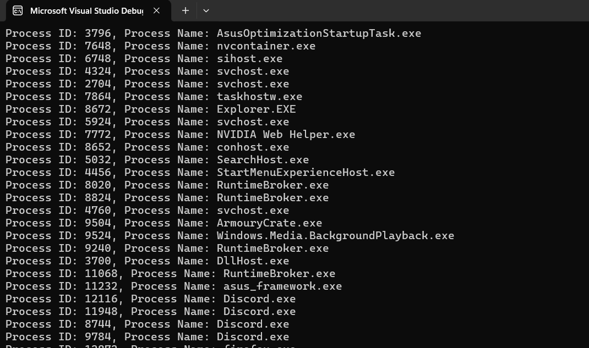

# ProcessAnalyzer
____

***Warning: This code is present for the sole purpose of learning programming in C language.***

ProcessAnalyzer is a tool for displaying running processes.

First, I used EnumProcesses to enumerate the processes by retrieving their IDs, then used OpenProcess and GetModuleBaseNameA to extract the information by retrieving the process handle and their names.

The result is as follows:

___
# Information :

## Information on compiling programs on Windows :

- [Compile a C program on the command line](https://learn.microsoft.com/en-us/cpp/build/walkthrough-compile-a-c-program-on-the-command-line?view=msvc-170)

## Function information :

- [EnumProcesses()](https://learn.microsoft.com/en-us/windows/win32/api/psapi/nf-psapi-enumprocesses)
- [OpenProcess()](https://learn.microsoft.com/en-us/windows/win32/api/processthreadsapi/nf-processthreadsapi-openprocess)
- [GetModuleBaseNameA()](https://learn.microsoft.com/en-us/windows/win32/api/psapi/nf-psapi-getmodulebasenamea)
